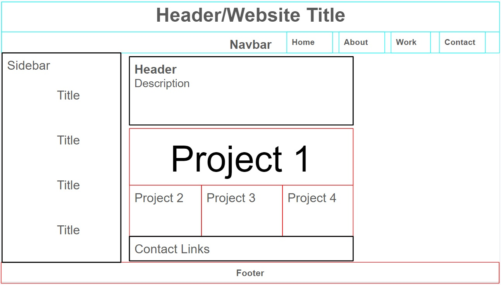

# My Professional Profile Webpage

## Table of Contents

1. Description
2. Installation
3. Usage
4. Support
5. Contributing
6. Authors and acknowledgment
7. License

## 1. Description

The website design aims to be:

+ Structured: the webpage layout is structured by different elements, such as a header, sidebar/aside, different sections, images, footer, and borders. 

+ Biographical: Providing a bio section, recent photo of me, informational sections about me, and links to my work and contact details

+ Navigational: Provides various links which guide the user to the corresponding sections of the page

+ Interactive: A Work section provides links to my deployed applications

+ Responsive: Uses media enquiries and viewport to create a responsible layout which adapts to the user's window or device size. Information has been put inside flexboxes to allow resizing of elements if the window is minimized.

## 2. Installation 
The website has been deployed over GitHub and is viewable through a web browser. The HTML and CSS code can be run through a code editor such as Visual Code Studio and previewed in a Live Server window.

## 3. Usage   

This website serves to promote my profile as a future graduate of coding bootcamp, and a way to introduce myself and show samples of my current work for employers to review and assess for potential employment. This also serves as a record of my current coding knowledge and skillset.

It includes sections such as an introduction and bio, samples of my previous work, and contact information with links.

## 4. Support   

For support, users can contact tydamon@hotmail.com.

## 5. Contributing   

Any contributions you make are greatly appreciated.

If you have a suggestion that would make this better, please fork the repo and create a pull request. You can also simply open an issue with the tag "enhancement". 
1.	Fork the Project
2.	Create your Feature Branch (git checkout -b feature/NewFeature)
3.	Commit your Changes (git commit -m 'Add some NewFeature')
4.	Push to the Branch (git push origin feature/NewFeature)
5.	Open a Pull Request

## 6. Authors and acknowledgment  

The author acknowledges and credits those who have contributed to this project, including:

- https://git.bootcampcontent.com/Monash-University/MONU-VIRT-FSF-PT-11-2023-U-LOLC
- Chee Ho Tai
- Pranita Shrestha

## 7. License   

Distributed under the MIT License. See LICENSE.txt for more information.